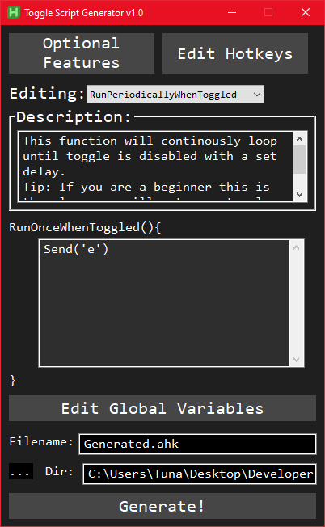

# Welcome to ToggleScriptGenerator!

## Edit Hotkeys
>  This is the place you will bind your hotkeys to desired functions.

Add -> Adds another binding.
Edit ->
- Record -> Focus on the box and record your hotkey.
- Input -> If the record option doesn't work you can directly input hotkeys in the form AHKv2 accepts it.
- Function -> This is the function the hotkey will bind to.
- Save -> Saves the hotkey.
- Save & Quit -> Saves the hotkey and closes popup.

Delete -> Deletes a binding.

## Edit Global Variables
> There are some global variables you can edit to your desired values.
```
SendMode -> The SendMode your script will use.
TimerDurationMS -> Duration between each run in miliseconds.
```

## Optional Features
> There are some global variables you can edit to your desired values.
```
AlwaysOnTop -> If GUI_Mode is enabled this will make the toggle gui AlwaysOnTop.
GUI_Mode -> Enables GUI_Mode which creates a basic gui for the toggle script.
RunRightOff -> Toggle runs immediately when the toggle is enabled without waiting the next timer cycle.
```

# Writing a Toggle Function
Basically the generator allows you to write your own ahk-v2 code to customise your toggle script.
There are 3 main functions you can edit. These are:
- RunOnceWhenToggled
- RunPeriodicallyWhenToggled
- RunWhenToggleIsDisabled
### RunOnceWhenToggled
Any script you'll put inside this function will run once only when toggle is enabled.
### RunPeriodicallyWhenToggled
Any script you'll put inside this function will run continously with set amount of delay.
### RunWhenToggleIsDisabled
Any script you'll put inside this function will run once only when toggle is disabled.

> Pro Tip: If you don't need a start and end function leaving first and third functions empty will make the generator not include them in the final file.

## Editing Toggle Functions
Simply click the drop down list next to the "Editing:" field and choose the desired function.
After that all you have to do is write some code into the editor just under the description.
> Pro Tip: The written code will be saved automatically.
> Tip: A description will appear for each function. Reading these may help.

# Generating The Final Script
1. Select your desired folder for the generated script.
2. Select your desired name for the generated script.
3. Hit Generate! and done.
> ProTip: Generator will automatically put .ahk at the end of the file name if you haven't.
